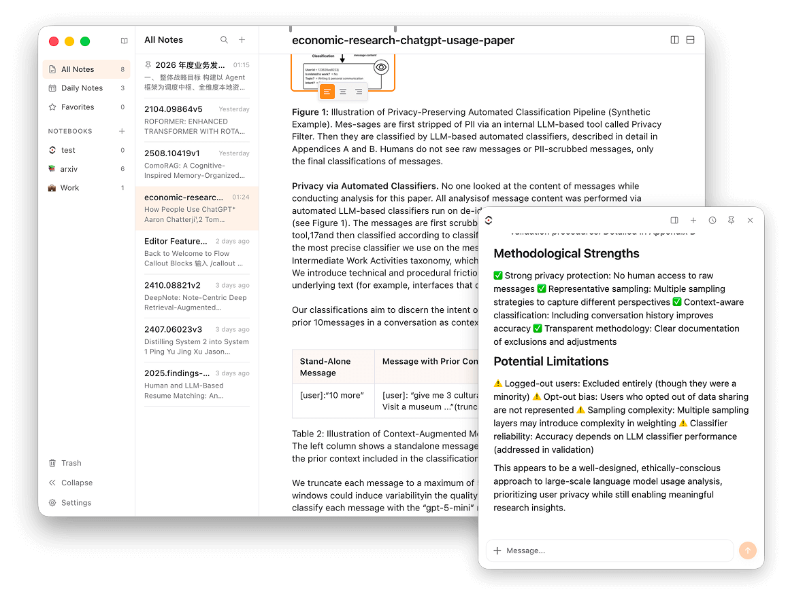

# Sanqian Notes

A modern, AI-powered note-taking app with bi-directional links, knowledge-base semantic search, local folder management, and other Obsidian-like features.

**[Download Sanqian Notes](https://sanqian.ai/note)** -- available for macOS and Windows



---

## Features

**AI**
- AI Chat -- integrated assistant with note context awareness
- AI Actions -- quick operations on selected text (explain, translate, summarize, etc.)
- RAG Knowledge Search -- semantic retrieval based on [WeKnora](https://github.com/Tencent/WeKnora), with structure-preserving chunking, query expansion, chunk merging, query rewrite, and rerank + MMR

**Editor**
- Block Editor -- WYSIWYG editing powered by Tiptap/ProseMirror
- Bi-directional Links -- `[[note]]`, `[[note#heading]]`, `[[note#^block]]` syntax
- Templates -- Obsidian-like template system with variables (`{{date}}`, `{{time}}`, `{{title}}`, etc.)
- Split Panes & Multi-tab -- view and edit multiple notes side by side

**Organization**
- Smart Views -- All Notes, Daily Notes, Recent, Favorites
- Full-text Search -- powered by SQLite FTS5
- Notebooks & Tags -- organize with folders and tags
- Local Folders -- manage local Markdown folders directly

**Import/Export**
- Markdown, PDF, Obsidian vault, Notion export

**Other**
- Dark/Light Mode -- follows system or manual toggle
- Multi-language -- English and Chinese

## Tech Stack

- **Framework**: Electron + React + TypeScript
- **Editor**: Tiptap (ProseMirror)
- **Styling**: Tailwind CSS
- **Database**: SQLite (better-sqlite3)
- **Vector DB**: sqlite-vec (semantic search)
- **AI**: Sanqian SDK

## Development

```bash
npm install                                # Install dependencies
npx electron-rebuild -f -w better-sqlite3  # Rebuild native modules for Electron
npm run dev                                # Start dev server
npm run test                               # Run tests
npm run verify:quality                     # Lint + typecheck + tests
npm run build                              # Build
```

## License

MIT
